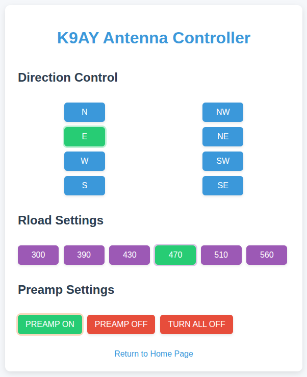
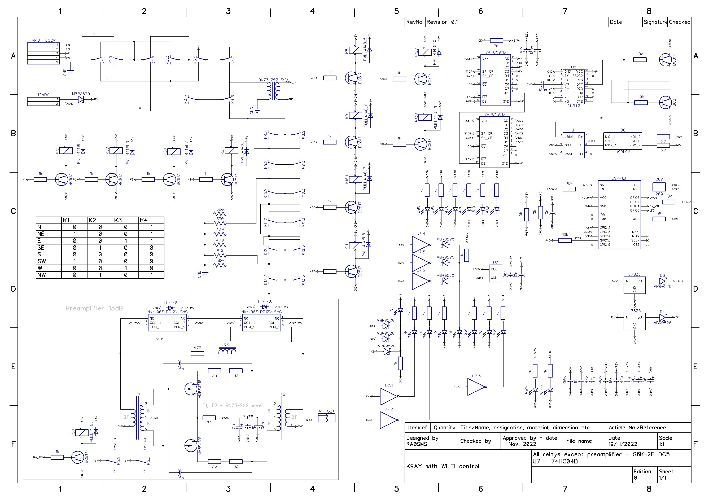

# K9AY receiving loop with Wi-Fi control

This antenna has 8 directions and switchable Load resistor

* Based on ESP8266 (esp-12 module with external Wi-Fi antenna)
* 2 loops and 8 directions
* Need only one power supply (12-13.8VDC, 500mA)
* Control via any web-browser
* Source code for Arduino IDE

More information about loop and construction details - https://ra0sms.com/k9ay-wifi-interface/

------

